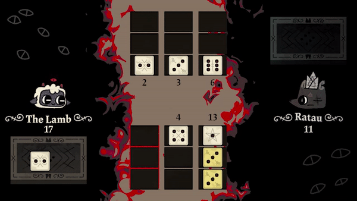
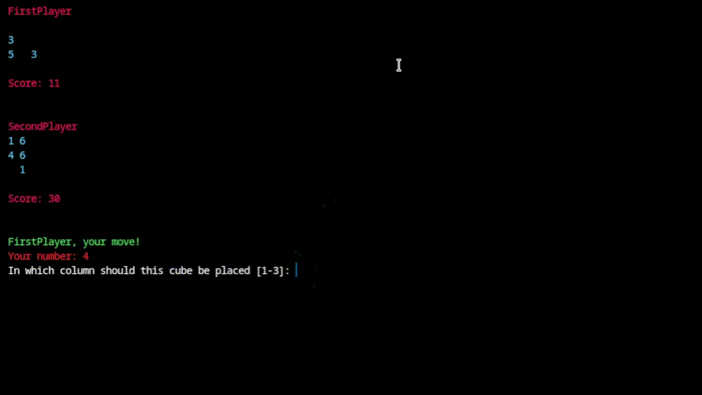

# KnucklebonesGo

The Knucklebones dice game in [**Cult of the Lamb**](https://en.wikipedia.org/wiki/Cult_of_the_Lamb). Implemented in Golang, running the game inside the console (bash, cmd)

_The game is designed for 2 players!_


## Launch

- Make sure you have one of the specified or intermediate versions of Golang installed
- Go to the required directory
- Run the command: ```go run main.go```

### Original game:


### KnucklebonesGo:
